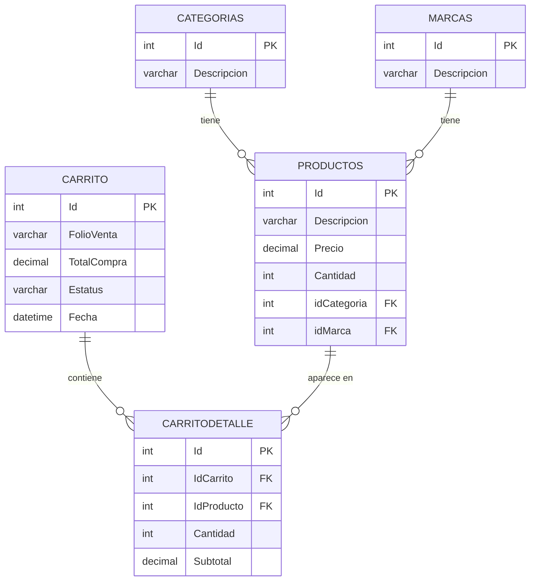

# Diagrama Entidad-Relación

## Modelo de datos del sistema de carrito de compras

## Relaciones

| Relación | Tipo | Descripción |
|---|---|---|
| **CATEGORIAS → PRODUCTOS** | 1 a muchos | Una categoría tiene muchos productos |
| **MARCAS → PRODUCTOS** | 1 a muchos | Una marca tiene muchos productos |
| **CARRITO → CARRITODETALLE** | 1 a muchos | Un carrito tiene muchas líneas de detalle |
| **PRODUCTOS → CARRITODETALLE** | 1 a muchos | Un producto puede aparecer en muchos detalles de carrito |
